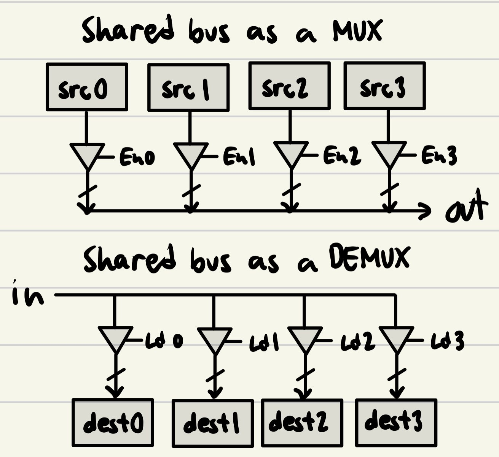

# 1. `if-generate` and `case-generate` examples

`if-generate` and `case-generate` statements lets us simplify structural-level code by adding conditionals on component instantiations.

## `if-generate`

Consider an N-bit adder composed of N full adders:

```vhdl
ENTITY n_bit_adder IS
	GENERIC (N : NATURAL);
	PORT (
		a : IN STD_LOGIC_VECTOR (N - 1 DOWNTO 0);
		b : IN STD_LOGIC_VECTOR (N - 1 DOWNTO 0);
		c_in : IN STD_LOGIC;
		sum : OUT STD_LOGIC_VECTOR (N - 1 DOWNTO 0);
		c_out : OUT STD_LOGIC
	);
END n_bit_adder;
```

```vhdl
ENTITY full_adder IS
	PORT (
		a : IN STD_LOGIC;
		b : IN STD_LOGIC;
		c_in : IN STD_LOGIC;
		sum : OUT STD_LOGIC;
		c_out : OUT STD_LOGIC
	);
END full_adder;
```

We can then instantiate these components using `if-generate`:

```vhdl
ARCHITECTURE Behavioral OF n_bit_adder IS
	SIGNAL carry_out : STD_LOGIC_VECTOR (N - 2 DOWNTO 0);
	COMPONENT full_adder IS
		PORT (
			a : IN STD_LOGIC;
			b : IN STD_LOGIC;
			c_in : IN STD_LOGIC;
			sum : OUT STD_LOGIC;
			c_out : OUT STD_LOGIC
		);
	END COMPONENT;
BEGIN
	FOR_GEN_LOOP : FOR i IN 0 TO N - 1 GENERATE
		BIT : IF (i = 0) GENERATE
			ADDER : full_adder PORT MAP(
				a => a(i),
				b => b(i),
				c_in => c_in,
				c_out => carry_out(i),
				sum => sum(i));
		ELSIF (i = N - 1) GENERATE
			ADDER : full_adder PORT MAP(
				a => a(i),
				b => b(i),
				c_in => carry_out(i - 1),
				c_out => c_out,
				sum => sum(i));
		ELSE GENERATE
				ADDER : full_adder PORT MAP(
					a => a(i),
					b => b(i),
					c_in => carry_out(i - 1),
					c_out => carry_out(i),
					sum => sum(i));
		END GENERATE BIT;
	END GENERATE FOR_GEN_LOOP;
END Behavioral;
```

## `case-generate`

This is similar to `if-generate` but the match expressions should be static (can't use the generic N).

Consider an 8-bit adder:

```vhdl
ENTITY n_bit_adder IS
	PORT (
		a : IN STD_LOGIC_VECTOR (7 DOWNTO 0);
		b : IN STD_LOGIC_VECTOR (7 DOWNTO 0);
		c_in : IN STD_LOGIC;
		sum : OUT STD_LOGIC_VECTOR (7 DOWNTO 0);
		c_out : OUT STD_LOGIC
	);
END n_bit_adder;
```

```vhdl
ARCHITECTURE Behavioral OF n_bit_adder IS
	SIGNAL carry_out : STD_LOGIC_VECTOR (6 DOWNTO 0);
	COMPONENT full_adder IS
		PORT (
			a : IN STD_LOGIC;
			b : IN STD_LOGIC;
			c_in : IN STD_LOGIC;
			sum : OUT STD_LOGIC;
			c_out : OUT STD_LOGIC
		);
	END COMPONENT;
BEGIN
	FOR_GEN_LOOP : FOR i IN 0 TO 7 GENERATE
		BIT : CASE i GENERATE
			WHEN 0 =>
				ADDER : full_adder PORT MAP(
					a => a(i),
					b => b(i),
					c_in => c_in,
					c_out => carry_out(i),
					sum => sum(i));
			WHEN 7 =>
				ADDER : full_adder PORT MAP(
					a => a(i),
					b => b(i),
					c_in => carry_out(i - 1),
					c_out => c_out,
					sum => sum(i));
			WHEN OTHERS =>
				ADDER : full_adder PORT MAP(
					a => a(i),
					b => b(i),
					c_in => carry_out(i - 1),
					c_out => carry_out(i),
					sum => sum(i));
		END GENERATE;
	END GENERATE FOR_GEN_LOOP;
END Behavioral;
```

# 2. 3 Situations where custom hardware design is needed

- When the device will rarely be replaced and there should consume little power (ex. pacemakers)
- When the device will be mass-produced and only the necessary functionality should be in the design. Microcontrollers have lots of features that might be left unused.
- When higher performance, greater system reliability, and lower latency is needed that microcontrollers just cannot provide (ex. wireless network interfaces).

# 3. Shared busses

Shared busses can be used to create a multiplexer by adding tri-state enable signals to the connections between data sources and the bus. It can also be used as a demultiplexer by adding tri-state load enable signals to the data destinations.



# 4. Why the datapath needs to be designed before the controller

The datapath is always designed before the controller because the datapath contains the logic for data manipulation and processing while the controller only needs to send control signals to and receive status signals from the datapath. Without the datapath design, it would be hard to determine what control signals to send from different status signals.`

# 5. 8-bit binary vector sequence processor design

Counter:

```vhdl
LIBRARY IEEE;
USE IEEE.STD_LOGIC_1164.ALL;
USE IEEE.NUMERIC_STD.ALL;

ENTITY up_counter IS
	GENERIC (WID : NATURAL);
	PORT (
		clk : IN STD_LOGIC;
		reset : IN STD_LOGIC;
		inc : IN STD_LOGIC;
		counter : OUT STD_LOGIC_VECTOR(WID - 1 DOWNTO 0);
		err : OUT STD_LOGIC
	);
END up_counter;

ARCHITECTURE counter_behavior OF up_counter IS
	SIGNAL counter_up : STD_LOGIC_VECTOR(WID - 1 DOWNTO 0);
	SIGNAL counter_err : STD_LOGIC;
	CONSTANT max_num : STD_LOGIC_VECTOR(WID - 1 DOWNTO 0) := (OTHERS => '1');
BEGIN
	INCREMENT : PROCESS (clk)
	BEGIN
		IF (clk'event AND rising_edge(clk)) THEN
			IF (reset = '0') THEN
				counter_up <= (OTHERS => '0');
				counter_err <= '0';
			ELSIF (counter_err = '0' AND inc = '1') THEN
				IF (counter_up = max_num) THEN
					counter_err <= '1';
				ELSE
					counter_up <= STD_LOGIC_VECTOR(unsigned(counter_up) + 1);
				END IF;
			END IF;
		END IF;
	END PROCESS;

	counter <= counter_up;
	err <= counter_err;

END counter_behavior;
```

Data path:

```vhdl
LIBRARY IEEE;
USE IEEE.STD_LOGIC_1164.ALL;

ENTITY data_path IS
	PORT (
		clk_in : IN STD_LOGIC;
		d_in : IN STD_LOGIC_VECTOR(7 DOWNTO 0);
		load : IN STD_LOGIC;
		reset_in : IN STD_LOGIC;
		display_sel : IN STD_LOGIC_VECTOR(1 DOWNTO 0);

		count : OUT STD_LOGIC_VECTOR(15 DOWNTO 0);
		err : OUT STD_LOGIC
	);
END ENTITY;

ARCHITECTURE data_path_struc OF data_path IS
	COMPONENT up_counter IS
		GENERIC (WID : NATURAL);
		PORT (
			clk : IN STD_LOGIC;
			reset : IN STD_LOGIC;
			inc : IN STD_LOGIC;
			counter : OUT STD_LOGIC_VECTOR(WID - 1 DOWNTO 0);
			err : OUT STD_LOGIC
		);
	END COMPONENT;

	-- inc(0) increment the total vectors counter
	-- inc(1) increment the odd parity counter
	-- inc(2) increment the three adjacent 1s counter
	SIGNAL inc : STD_LOGIC_VECTOR(2 DOWNTO 0);
	SIGNAL counter_err : STD_LOGIC_VECTOR(2 DOWNTO 0);

	SIGNAL total_count : STD_LOGIC_VECTOR(15 DOWNTO 0);
	SIGNAL odd_parity_count : STD_LOGIC_VECTOR(15 DOWNTO 0);
	SIGNAL adjacent_count : STD_LOGIC_VECTOR(15 DOWNTO 0);
BEGIN
	tot_counter : up_counter
	GENERIC MAP(WID => 16)
	PORT MAP(clk => clk_in, reset => reset_in, inc => inc(0), counter => total_count, err => counter_err(0));

	odd_counter : up_counter
	GENERIC MAP(WID => 16)
	PORT MAP(clk => clk_in, reset => reset_in, inc => inc(1), counter => odd_parity_count, err => counter_err(1));

	adj_counter : up_counter
	GENERIC MAP(WID => 16)
	PORT MAP(clk => clk_in, reset => reset_in, inc => inc(2), counter => adjacent_count, err => counter_err(2));

	err <= OR(counter_err); -- use reductive OR function

	count <= odd_parity_count WHEN display_sel = "01" ELSE
		adjacent_count WHEN display_sel = "10" ELSE
		total_count;

	inc(0) <= load;
	inc(1) <= load AND XOR (d_in);
	inc(2) <= load AND
	( AND (d_in(7 DOWNTO 5)) OR AND (d_in(6 DOWNTO 4)) OR
	AND (d_in(5 DOWNTO 3)) OR AND (d_in(4 DOWNTO 2)) OR
	AND (d_in(3 DOWNTO 1)) OR AND (d_in(2 DOWNTO 0)));
END data_path_struc;
```

Controller:

```vhdl
LIBRARY IEEE;
USE IEEE.STD_LOGIC_1164.ALL;

ENTITY controller IS
	PORT (
		-- external inputs
		clk : IN STD_LOGIC;
		reset : IN STD_LOGIC;
		clear_results : IN STD_LOGIC;
		load : IN STD_LOGIC;
		sel_display : IN STD_LOGIC_VECTOR(1 DOWNTO 0);

		-- external outputs
		ack : OUT STD_LOGIC;
		err : OUT STD_LOGIC;

		-- internal inputs (from datapath)
		err_in : IN STD_LOGIC;

		-- internal outputs (to datapath)
		load_in : OUT STD_LOGIC;
		reset_in : OUT STD_LOGIC;
		sel_display_in : OUT STD_LOGIC_VECTOR(1 DOWNTO 0)
	);
END ENTITY;

ARCHITECTURE Behavioral OF controller IS
BEGIN
 -- :)
END Behavioral;
```

System:

```vhdl
LIBRARY IEEE;
USE IEEE.STD_LOGIC_1164.ALL;
USE IEEE.NUMERIC_STD.ALL;

ENTITY system IS
	PORT (
		-- external inputs
		clk : IN STD_LOGIC;
		reset : IN STD_LOGIC;
		clear_results : IN STD_LOGIC;
		load : IN STD_LOGIC;
		sel_display : IN STD_LOGIC_VECTOR(1 DOWNTO 0);
		d : IN STD_LOGIC_VECTOR(7 DOWNTO 0);

		-- external outputs
		ack : OUT STD_LOGIC;
		err : OUT STD_LOGIC;
		count : OUT STD_LOGIC_VECTOR(15 DOWNTO 0)
	);
END system;

ARCHITECTURE Behavioral OF system IS
	COMPONENT data_path IS
		PORT (
			clk_in : IN STD_LOGIC;
			d_in : IN STD_LOGIC_VECTOR(7 DOWNTO 0);
			load : IN STD_LOGIC;
			reset_in : IN STD_LOGIC;
			display_sel : IN STD_LOGIC_VECTOR(1 DOWNTO 0);

			count : OUT STD_LOGIC_VECTOR(15 DOWNTO 0);
			err : OUT STD_LOGIC
		);
	END COMPONENT;

	COMPONENT controller IS
		PORT (
			clk : IN STD_LOGIC;
			reset : IN STD_LOGIC;
			clear_results : IN STD_LOGIC;
			load : IN STD_LOGIC;
			sel_display : IN STD_LOGIC_VECTOR(1 DOWNTO 0);
			ack : OUT STD_LOGIC;
			err : OUT STD_LOGIC;

			err_in : IN STD_LOGIC;
			load_in : OUT STD_LOGIC;
			reset_in : OUT STD_LOGIC;
			sel_display_in : OUT STD_LOGIC_VECTOR(1 DOWNTO 0)
		);
	END COMPONENT;

	SIGNAL err_in : STD_LOGIC;
	SIGNAL sel_display_in : STD_LOGIC_VECTOR(1 DOWNTO 0);
	SIGNAL reset_in : STD_LOGIC;
	SIGNAL load_in : STD_LOGIC;
BEGIN
	ctrl : controller PORT MAP(
		clk => clk,
		reset => reset,
		clear_results => clear_results,
		load => load,
		sel_display => sel_display,
		ack => ack,
		err => err,
		err_in => err_in,
		load_in => load_in,
		reset_in => reset_in,
		sel_display_in => sel_display_in
	);

	dp : data_path PORT MAP(
		clk_in => clk,
		d_in => d,
		load => load_in,
		reset_in => reset_in,
		display_sel => sel_display_in,
		count => count,
		err => err_in
	);
END Behavioral;
```
